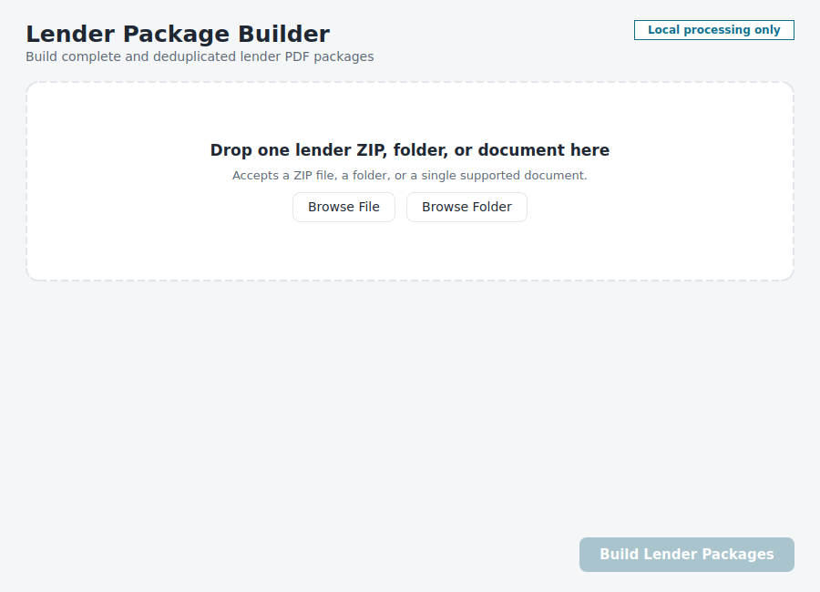
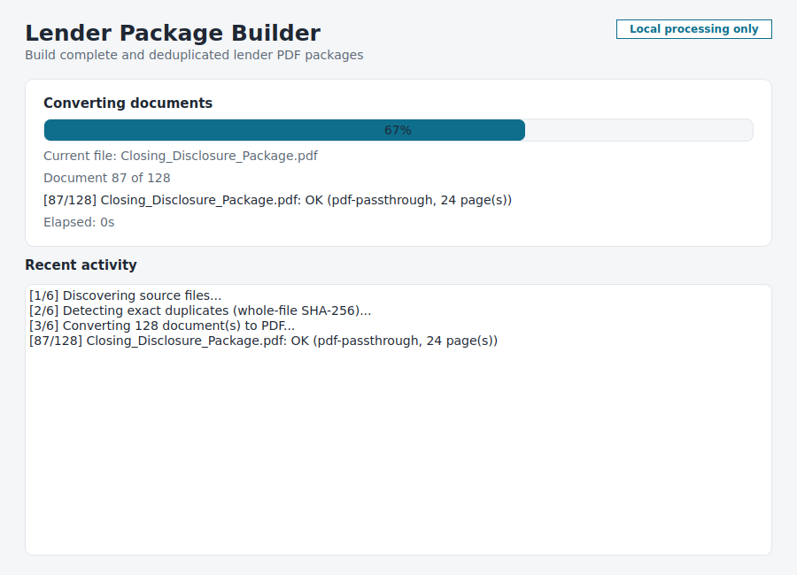
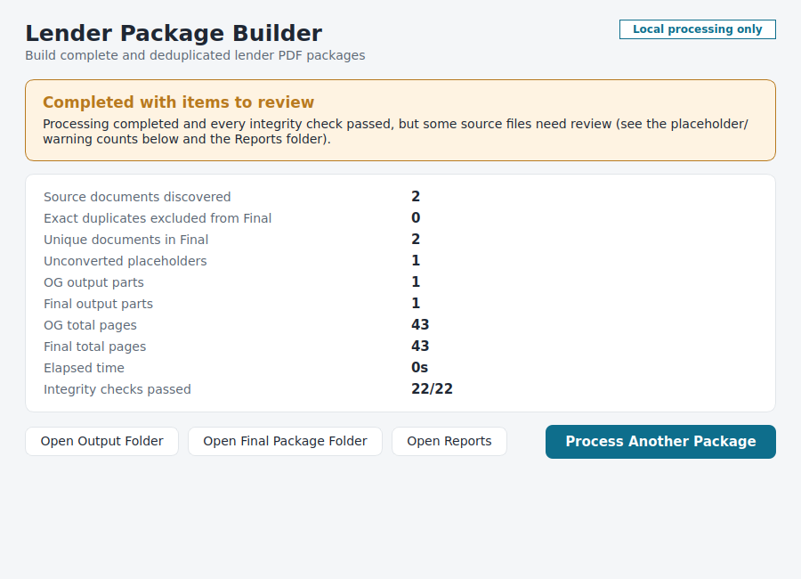

# Document Merger (RC2)

A local, offline tool that turns a lender ZIP, nested ZIP, folder, or
loose document collection into two organized PDF packages inside one
named output folder:

- **Original Lender Package** -- every source document, in original
  order, nothing removed.
- **Lender Package** (the "Final" package) -- the same, minus later
  occurrences of duplicate or redundant source content, detected safely
  across several layered, content-aware checks (see "What RC2 adds" in
  `RC2_DELIVERABLE_REPORT.md`).

**The core safety rule: one source file equals one indivisible
document.** Nothing in this application ever deletes, merges, or
compares content at the page level in a way that could split or
reorder a source document. See `NON_NEGOTIABLE_SAFETY_RULE` below.

Everything runs on your own computer. No file, filename, hash, or
report is ever uploaded anywhere. There is no telemetry.

Beyond building a package, Document Merger can also:

- **Safely cancel a run in progress** ("Cancel Processing") without
  ever leaving a partial file under a real package name, and without
  ever touching your source files.
- **Locate and extract key documents** from the completed Final
  package -- the Closing Disclosure (flagging any wet-signed copy),
  Driver's Licenses, the Mortgage Unity Privacy Policy specifically,
  and loan non-proceeding documentation (adverse action, withdrawal,
  denial, or cancellation notices) -- with page locations reported in
  plain English and, for confidently-identified matches, extracted as
  their own standalone files.
- **Compare two packages** ("Compare Packages") -- an old/reference
  package against a newly generated one -- to confirm nothing
  meaningful went missing and nothing was wrongly duplicated, without
  ever modifying either package.

**Stage 1** is the command-line processing engine. **Stage 2** adds a
polished PySide6 desktop window around that same engine -- no command
line required. **Stage 3** packages both into a portable Windows
`.exe` that needs no Python install, no admin rights, and no
installer -- see **STAGE3_BUILD_AND_RELEASE.md** and
**README_PORTABLE.txt**. This is currently release candidate `RC2` --
see **WINDOWS_ACCEPTANCE_TEST_CHECKLIST.md** for the manual acceptance
checklist.

---

## Quick start

**Portable Windows application (no Python required):** download the
release ZIP, extract it, and double-click `LenderPackageBuilder.exe`.
See **README_PORTABLE.txt** for the full walkthrough.

**Desktop application from source (Windows, non-technical):** see
**STAGE2_WINDOWS_TEST_INSTRUCTIONS.md** for a full plain-English
walkthrough. The short version:

1. Double-click `SETUP_AND_TEST.bat` and wait for it to finish.
2. Double-click `RUN_GUI.bat`.
3. Drag a ZIP, folder, or document onto the window and click
   **Build Lender Packages**.

**Command line:** see **FIRST_TEST_INSTRUCTIONS.md**. The short
version:

1. Double-click `SETUP_AND_TEST.bat` and wait for it to finish.
2. Drag a ZIP file onto `RUN_STAGE1.bat`.
3. Open the new output folder created next to your ZIP.

---

## The non-negotiable safety rule

A source file may be one page or a thousand pages. Regardless of its
content, the entire source file always stays together as one document.

This application never:

- deletes an individual page because it resembles another page,
- performs page-level deduplication,
- splits one source document across two output files,
- guesses internal document boundaries inside a PDF,
- separates forms bundled inside one source PDF, or
- treats two files as duplicates because their titles or visible text
  look similar.

Two files are only ever treated as duplicates when their **original
SHA-256** (computed on the untouched source bytes, before any
conversion) is identical. Filename, extracted text, OCR, page hashes,
visual similarity, converted-PDF hashes, and metadata are never used to
decide a duplicate.

---

## Requirements

- Windows 11 (primary target), or any OS with Python for development.
- Python 3.11, 3.12, or 3.13 (64-bit). Python 3.13 is fully supported
  and preferred when available -- it is not hardcoded to 3.11.
- No administrator rights required. Nothing is installed outside this
  project folder's `.venv`.
- Optional, for higher-fidelity DOCX/XLS(X)/DOC conversion: a local
  install of **LibreOffice** (free) or **Microsoft Office**. Without
  either, DOCX/XLSX still convert via a built-in fallback renderer
  (plain text/tables only, clearly labeled as such in the report);
  legacy `.doc`/`.xls` without LibreOffice or Office become placeholders
  (see "Known Stage 1 Limitations").

## Installation

### Windows (recommended path)

Double-click `SETUP_AND_TEST.bat`. It finds a supported Python,
creates `.venv` in this folder, installs dependencies into it, and runs
the automated test suite.

### Manual / developer setup (any OS)

```bash
python3 -m venv .venv
source .venv/bin/activate        # Windows: .venv\Scripts\activate
pip install -r requirements.txt
pip install -e .
pytest tests -v
```

## Command-line usage

```
python -m lender_package_builder build "<input_path>" [options]
```

Options:

| Flag | Meaning |
|---|---|
| `--output PATH` | Explicit output folder (default: a new timestamped folder next to the input). |
| `--max-pages-per-part N` | Maximum pages allowed in one output PDF part (default from `config.toml`; see "Choosing the output-part size defaults" below). This is a ceiling, not a target -- see "Output splitting is a maximum, not a target" below. |
| `--max-size-mb-per-part N` | Maximum megabytes allowed in one output PDF part (default from `config.toml`). Also a ceiling, not a target. |
| `--allow-large-input` | Bypass ZIP-bomb-style safety thresholds for a known, intentional large package. |
| `--keep-temp` | Do not delete the temporary working folder after a successful run (useful for diagnostics). |
| `--verbose` | Print debug-level logging to the console as well as the log file. |
| `--config PATH` | Use a specific `config.toml` instead of the default. |
| `--quiet` | Suppress the live per-document progress lines (still prints the final summary). |

The exit code is `0` only when the build completed **and** every
required integrity check passed.

## Desktop application (Stage 2)

A native PySide6/Qt desktop window around the exact same engine --
`gui/main_window.py` calls `cli.build_package()` directly, on a
background `QThread`, and never re-implements any processing logic.

Launch it with:

```
python -m lender_package_builder.gui         (any OS with a display)
```

or, on Windows, double-click **`RUN_GUI.bat`**.

| State | Screenshot |
|---|---|
| Idle / drop |  |
| Processing |  |
| Completion |  |

Screenshots were captured from this repository's own automated test
harness using synthetic data (see "Manual GUI verification performed"
below) -- not a real lender package.

Highlights:

- **Drag-and-drop or Browse File/Browse Folder** -- accepts exactly one
  ZIP, folder, or document at a time; dropping more than one shows a
  friendly message instead of silently picking one.
- **Advanced Settings** (collapsed by default) exposes the same
  `max_pages_per_part` / `max_size_mb_per_part` ceilings as the CLI,
  with the same "these are maximums, not targets, and no document is
  ever split" explanation baked into the UI text.
- **Structured progress**, via `lender_package_builder.progress`
  (`ProgressStage` / `ProgressEvent`) -- a new, additive, optional
  `progress_callback` parameter on `build_package()`. Existing callers
  that don't pass one see no behavior change at all.
- **Background worker** (`gui/worker.py`) -- the engine always runs on
  a `QThread`, never the UI thread; the window stays responsive and
  disables input controls while a job is running, and warns (rather
  than silently allowing) closing the window mid-job.
- **Success / warning / failure states** driven entirely by the real
  `RunResult` -- a run is only ever shown as successful when every
  integrity check actually passed, even if PDFs were produced.
- **Large-input confirmation** -- exceeding the configured hard safety
  limit requires an explicit "Process This Known Large Package" click
  before `allow_large_input=True` is ever passed to the engine.
- **Cancel Processing** -- a visible button appears during processing;
  clicking it asks "Stop processing this package?" (Continue
  Processing / Stop Processing) before anything happens, so a single
  accidental click never cancels a run. Cancellation is cooperative and
  checked throughout every stage (inventory, archive extraction,
  document conversion, fingerprinting, comparison, merging), never
  force-kills the background thread, never modifies your source files,
  and never leaves a partial file under a real `Lender Package.pdf` /
  `Original Lender Package.pdf` name -- a cancelled run is always shown
  as clearly Cancelled, never as success, and you can immediately start
  a new package without restarting the app.
- **Key-document page locator** -- once the Final package is built, the
  app looks for a Closing Disclosure (flagging any wet-signed copy
  specifically), Driver's Licenses (front/back, per borrower), the
  Mortgage Unity Privacy Policy, and loan non-proceeding documentation
  (adverse action, withdrawal, denial, or cancellation notices), and
  reports exactly where each one is -- part filename, page range inside
  that part, and overall package page range -- in plain English, in
  `Key Document Page Locations.txt`, and in the completed-run screen.
  Confidently-identified matches (Confirmed / Strong Match) are also
  extracted as their own standalone files inside `Final`; anything less
  certain (Possible Match) stays flagged for your own review rather
  than being auto-extracted. The completed-run screen also always shows
  a "Wet-Signed Documents Found" count and a separate "Wet-Signed
  Closing Disclosure" status, since the CD not being wet-signed doesn't
  mean nothing else in the package is.
- **Compare Packages** -- a separate workspace (its own "Compare
  Packages" button in the header) for comparing an old/reference
  package against a newly generated one, useful when a package was
  compiled by hand and may still contain duplicates. It never modifies
  either package -- it only reports Exact Match, Equivalent Content,
  Contained in Larger Document, Same Document/Different Version,
  Meaningful Difference, Likely Duplicate Removed, Moved or Reordered,
  Only in Old, Only in New, Possible Missing Document, Extra Blank/
  Cover/Index/Report Page, Unrecognized Section, or Needs Review for
  every page on both sides, with the same protected-difference rules
  (signatures, dates, dollar amounts, names, form values, and so on)
  the rest of this app already enforces -- nothing is ever called
  "missing" without first checking whether it moved, was contained in a
  larger document, or was a correctly-removed duplicate.

## Configuration

Defaults live in `config.toml` at the project root:

```toml
[splitting]
max_pages_per_part = 750
max_size_mb_per_part = 100

[safety]
large_input_warning_mb = 2000
max_expanded_size_mb = 8000
max_archive_entries = 200000
required_free_space_multiplier = 3.0

[conversion]
office_backend_order = ["libreoffice", "office_com", "fallback"]
```

Command-line flags (`--max-pages-per-part`, `--max-size-mb-per-part`, etc.)
override these per run without editing the file. Editing `config.toml`
changes the default for every future run, with no source code changes
required.

### Output splitting is a maximum, not a target

`max_pages_per_part` and `max_size_mb_per_part` are **ceilings**, not
sizes the tool tries to reach. Complete source documents are added to
the current output part, in original order, until adding the *next
complete* document would exceed either maximum. At that point the
current part is closed -- however far below the maximum it happens to
be -- and a new part is started with that document. Parts are never
padded, and documents are never reordered to fill unused space.

Example, with a 400-page maximum:

| Document | Pages |
|---|---|
| A | 125 |
| B | 98 |
| C | 162 |
| D | 41 |

Required result: **Part 1** = A + B + C (385 pages, left below the
400-page maximum on purpose). **Part 2** = D (41 pages). It is
forbidden to take 15 pages out of D to pad Part 1 to exactly 400 -- no
source document is ever split, for any reason.

A single source document that, on its own, exceeds a maximum is kept
completely intact in its own oversized output part. This is reported,
never treated as a failure, and never split.

A package's *total* page count is never treated as an output-part
limit -- a package with 3,000+ pages across many documents simply
produces as many parts as it needs.

### Choosing the output-part size defaults

The shipped defaults (750 pages / 100 MB per part) come from
`benchmarks/benchmark_pdf_defaults.py`, a script that generates two
families of synthetic PDFs -- dense **digital-text** pages (the common
case for disclosures, applications, statements) and **scanned/
image-heavy** pages (the common case for signed forms, IDs, and
mailed-in documents) -- at page counts from 50 up to 3,000, and
measures, on this development machine:

- on-disk file size and KB/page,
- time to open the file and read its page count (`pypdf`),
- time to extract all text (a proxy for local search/indexing cost),
- an estimated cost to page through the whole document, derived from
  rendering two small sample chunks with poppler's `pdftoppm` (the same
  rasterizer used by many Linux/desktop PDF viewers) and solving for a
  fixed per-open cost plus a marginal per-page cost -- this keeps the
  benchmark itself fast even at thousands of pages while still
  reflecting real per-page rendering cost.

Full results are in `benchmarks/results.md`, regenerated by re-running
the script. Key observations from this machine's results:

- Digital-text pages in this benchmark are very cheap (well under 1
  KB/page for dense paragraph text), so `max_size_mb_per_part` is
  rarely the binding constraint for pure-text packages -- page count
  dominates, and 750 pages keeps a part's *rendering* cost in the tens
  of seconds rather than minutes, while still avoiding an unmanageable
  number of parts for a large disclosure package.
- Scanned/image-heavy pages in this benchmark run roughly 300+ KB/page
  at a realistic 150 DPI business-scan resolution, so file size becomes
  the binding constraint well before 750 pages -- a 100 MB ceiling
  typically closes a scanned-heavy part in the low hundreds of pages,
  which keeps individual part files comfortably below common email/
  portal attachment limits (many lender and title-company portals cap
  attachments around 25-100 MB) and away from sizes that make
  Windows Explorer, antivirus scanning, or cloud-sync (OneDrive/Teams)
  noticeably sluggish on typical hardware.
- 100 MB was chosen over a much larger ceiling because very large
  single PDFs (many hundreds of MB) visibly slow down opening, page
  navigation, and full-text search in common viewers, and are more
  likely to be rejected outright by upload portals and email systems.

**Important caveats, stated plainly and not as a guarantee:**

- This benchmark ran inside a shared, sandboxed development container,
  not a physical Windows 11 business laptop -- the *absolute* millisecond
  numbers in `benchmarks/results.md` are almost certainly slower than a
  real desktop's dedicated CPU/GPU rendering path. They are used here
  for *relative* comparison (digital-text vs. scanned, cost scaling with
  page count) and rough magnitude, not as a precise prediction of your
  computer's performance.
- "Smooth" depends on your hardware, your PDF viewer, and what else is
  running -- these numbers are a reasoned starting point, not a
  universal promise.
- Both maximums are trivially changeable per run (`--max-pages-per-part`,
  `--max-size-mb-per-part`) or permanently (`config.toml`) with no code
  changes, specifically so you can tune them for your own machine and
  document mix.

## Output layout

The GUI collects the borrower's last name, first name, loan number, and
whether the file is adverse/withdrawn/denied/cancelled *before*
processing starts, and shows a live preview of the exact output folder
name -- nothing here is guessed from automatic recognition alone. The
main output folder is created next to the input (or wherever you choose)
using commas between every value, no underscores:

```
Last Name, First Name, Loan Number/
├── Final/                 Lender Package + Original Lender Package + any extracted key documents
├── Reports/                Processing_Report.txt, Key Document Page Locations.txt,
│                           Processing_Manifest.json, run.log, and every other report
└── Unconverted Files/       Only created if a file genuinely could not be converted
```

(An adverse/withdrawn/denied/cancelled file instead names the main
folder `Last Name, First Name, Adverse, Loan Number`.) If a folder
with that exact name already exists, it is never overwritten -- a new
run automatically becomes `..., v2`, `..., v3`, and so on.

There is no separate `OG` or `Logs` folder -- the Original Lender
Package lives directly inside `Final`, alongside the deduplicated
Lender Package and any extracted key documents, and `run.log` lives in
`Reports`. Example filenames inside `Final` for borrower Michael True,
loan `6192278785`:

```
True, Michael, Lender Package.pdf                       (single-part Final package)
True, Michael, Original Lender Package.pdf               (single-part Original package)
True, Michael, Original Lender Package, Part 001.pdf     (only when there is more than one part)
True, Michael, Closing Disclosure, Signed, 6192278785.pdf              (extracted key document)
True, Michael, Driver's License Front, E-Sign, 6192278785.pdf
```

`Processing_Report.txt` (in `Reports`) is the main human-readable
summary, including every one of the 22 integrity checks (18 required
by the original spec, strengthened with 4 additional independent
page-count re-verification checks) with an explicit PASS/FAIL. The CLI
never reports overall success if any check fails.

## Project structure

```
src/lender_package_builder/
├── cli.py            Argument parsing + top-level pipeline orchestration
├── config.py          config.toml loading
├── models.py           Core data classes (SourceOccurrence, OutputPart, PackageIdentity, ...)
├── naming.py            Single source of every user-facing output name (folder, package, key-doc filenames)
├── cancellation.py       CancellationToken / check_cancelled() cooperative cancellation
├── key_documents.py       Key-document page locator + extraction (Closing Disclosure, Driver's
│                          Licenses, MU Privacy Policy, loan non-proceeding documentation)
├── compare_packages.py     Compare Packages engine (analysis-only, never modifies either package)
├── progress.py           ProgressStage / ProgressEvent structured progress API
├── inventory.py         Discovery, traversal order, natural sort
├── archives.py           ZIP safety: path sanitization, ignored-artifact detection, size estimation
├── hashing.py             Whole-file SHA-256
├── deduplication.py        Exact whole-file duplicate detection
├── conversion/               One converter module per format (pdf, images, text, html, office, email)
├── merging.py               Whole-document PDF merging into output parts
├── splitting.py               Whole-document output-splitting plan
├── validation.py                22 integrity checks (18 required + 4 strengthened re-verification checks)
├── reporting.py                  Plain-text + JSON report generation, key-document report
├── workspace.py                   Temporary workspace management
├── exceptions.py                   Error types, ProcessingCancelledError
└── gui/                              Stage 2: PySide6 desktop application
    ├── app.py                          QApplication bootstrap
    ├── main_window.py                  Top-level window, state, wiring, top-level build/compare stack
    ├── worker.py                       Background QThread worker layer (build + compare jobs)
    ├── theme.py                        Colors, fonts, stylesheet
    ├── state.py                        GUI-side data models (no Qt)
    ├── dialogs.py                      Cancel/close/compare confirmation and disambiguation dialogs
    ├── os_actions.py                   Open-folder / open-file (QDesktopServices) actions
    ├── formatting.py                   Byte-size / elapsed-time display helpers
    ├── assets/app_icon.svg               Local application icon
    └── widgets/                          drop_zone, advanced_settings, progress_view, result_view,
                                           package_identity_dialog, compare_side_selector,
                                           compare_progress_view, compare_results_view, compare_workspace
```

## Testing

```
.venv\Scripts\python.exe -m pytest tests -v      (Windows)
.venv/bin/python -m pytest tests -v              (macOS/Linux)
```

392 automated tests: 311 engine tests (`tests/*.py`) and 81 GUI tests
(`tests/gui/*.py`, using `pytest-qt` with the Qt `offscreen` platform),
covering every Stage 1/2/3 scenario plus RC2's content-aware
deduplication engine and the naming, cancellation, key-document
locator/extraction, and Compare Packages milestones described above.

**Environment note:** on the headless Linux container this project was
built and tested in, `QT_QPA_PLATFORM=offscreen` is required (no real
display); on real Windows the native Qt platform plugin is used
automatically instead. In that headless container, running the full
GUI test suite in one process occasionally segfaults strictly at
Python/Qt interpreter *shutdown*, after every test has already
passed -- a known category of PySide6/Shiboken fragility specific to
the `offscreen` platform under heavy repeated widget construction/
destruction in one long-lived process, not a defect in any individual
test or in the application. Every individual test passes reliably and
repeatedly; no crash has ever occurred with application code on the
stack. This has not been observed running the GUI normally (one
window, one process lifetime) and is not expected on real Windows with
the native window system.

**Packaged-build verification:** the Windows portable `.exe` is built
and additionally verified by a real Windows GitHub Actions runner (see
`.github/workflows/build-windows-portable.yml`), including running its
`--self-test` with `PYTHONHOME`/`PYTHONPATH` cleared and a minimized
`PATH` to prove it needs no external Python. See
`STAGE3_BUILD_AND_RELEASE.md` for exactly what is and is not covered
by that CI run versus what still needs your own manual test on a
physical Windows 11 computer.

## Roadmap

- **Stage 1:** local processing engine, CLI, automated tests, setup
  scripts, conversion, deduplication, PDF merging/splitting, reports.
  Complete.
- **Stage 2:** PySide6 desktop window around the same engine,
  structured progress API, background worker, drag-and-drop, advanced
  settings, success/warning/failure states, GUI automated tests.
  Complete.
- **Stage 3 (this delivery):** a portable Windows package needing no
  Python install, no admin rights, and no installer. CI-verified on a
  real Windows GitHub Actions runner; pending your own manual
  acceptance test on a physical Windows 11 computer before being
  called a finished, final `v1.0.0`. See `STAGE3_BUILD_AND_RELEASE.md`
  and `WINDOWS_ACCEPTANCE_TEST_CHECKLIST.md`.

## Known limitations

**Stage 1** -- see the "Known Stage 1 Limitations" summary from the
original build for the full list (Windows/Office-automation testing
status, MSG fixture coverage, very large nested archives, etc). Nothing
in that list weakens the non-negotiable safety rule -- it only
describes conversion-fidelity and environment edge cases.

**Stage 2 additions:**

- The GUI has been run and tested extensively on this Linux development
  machine (real widget behavior, drag-and-drop logic, the real
  background worker, a full synthetic end-to-end run) using Qt's
  `offscreen` platform and `Xvfb`-free screenshot capture -- it has
  **not** been run on a real Windows 11 desktop. Windows-specific
  concerns (native drag-and-drop from Explorer, DPI scaling on a real
  multi-monitor setup, SmartScreen prompts, `pythonw.exe` launch
  behavior) still need real-machine verification; see
  `STAGE2_WINDOWS_TEST_INSTRUCTIONS.md`.
- See "Testing" above for the headless-offscreen-platform shutdown-crash
  caveat in this development container.
- The large-input confirmation dialog only appears when the
  background size estimate has already completed by the time you click
  **Build Lender Packages**; if you click before it finishes (rare, on
  a very large input, with an unusually slow disk), the engine's own
  safety check still applies and safely stops with a clear error --
  nothing is silently bypassed, but the friendlier confirmation dialog
  is skipped in that edge case.
- The GUI does not yet have an action to reopen a previously exported
  `Package Comparison Manifest.json` and redisplay a Compare Packages
  result without rerunning the comparison -- the underlying source-hash
  primitive (`compare_packages.compute_source_hash()`) exists and is
  tested, but the GUI "load saved comparison" action itself has not
  been built.

**Stage 3 additions:**

- The portable `.exe` has been built and verified on a real Windows
  GitHub Actions runner (full test suite, `--self-test`,
  `--diagnostics`, `--gui-smoke-test`, with `PYTHONHOME`/`PYTHONPATH`
  cleared and a minimized `PATH`, and from a space-containing path) --
  it has **not yet** been manually tested on a physical Windows 11
  computer. See `STAGE3_BUILD_AND_RELEASE.md` section 2 for the exact
  CI-tested-vs-manual-test boundary, and
  `WINDOWS_ACCEPTANCE_TEST_CHECKLIST.md` for that manual test.
- The executable is unsigned (no commercial code-signing certificate
  yet) -- expect a first-run Windows SmartScreen/antivirus warning; see
  `README_PORTABLE.txt` and `PACKAGING_TROUBLESHOOTING.md`.
- `extract-msg` (`.msg` conversion) is GPLv3-licensed and used
  in-process, which is a genuine, unresolved tension with this
  project's "Proprietary" license for anything beyond local/internal
  use -- flagged prominently at the top of `THIRD_PARTY_NOTICES.txt`
  rather than silently resolved. Does not affect local use.
- Microsoft Office COM automation (via `pywin32`, Windows-only) is
  implemented and bundled but has not been exercised against a real,
  licensed Office installation as part of this build.
